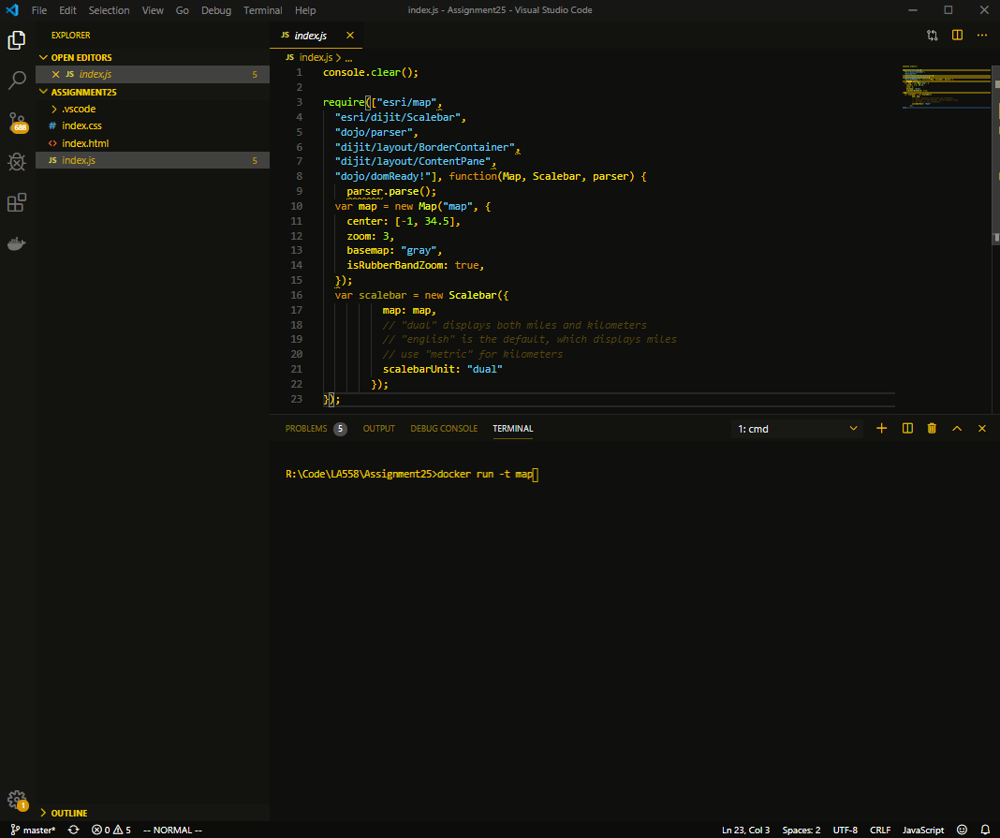

# AmberGlow
## VS Code extension balancing, ergonomics, syntax highlighting, and retro charm.  

Inspired by the 1986 study by E, Grandjean on monochrome monitors, that claims that amber terminals are cause less eyestrain, ballanced with the need for good syntax highlighting.  Uses complimentary pastel blues, purples and greens.  Attempts to use darker amber for comments to de-emphasize and highlighted items use bright yellow, simulating the brighter and darker phosphors on an amber display.  Made using VS code style generator

## Source

https://github.com/sphadley/AmberGlow